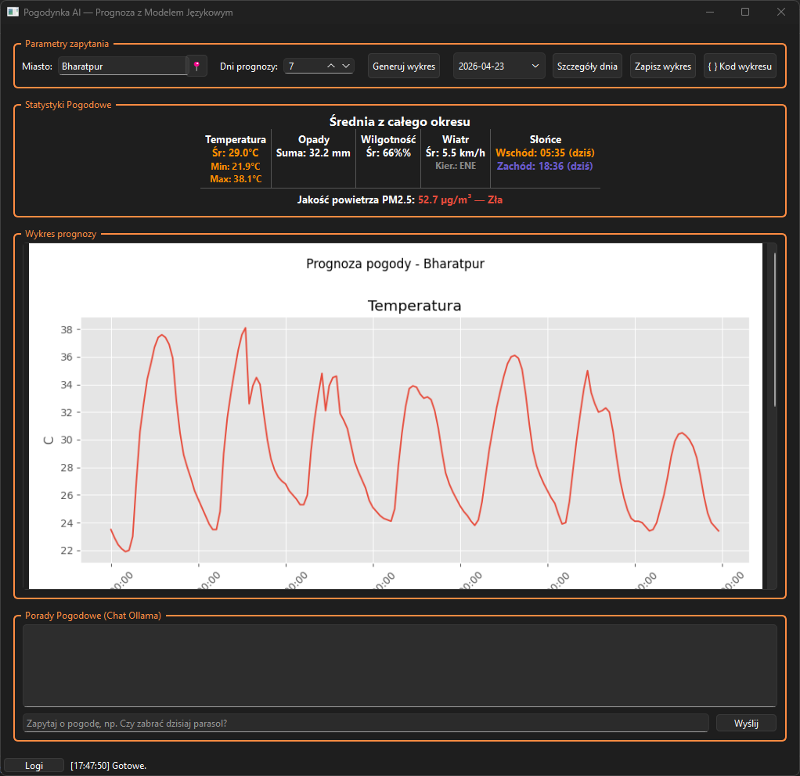
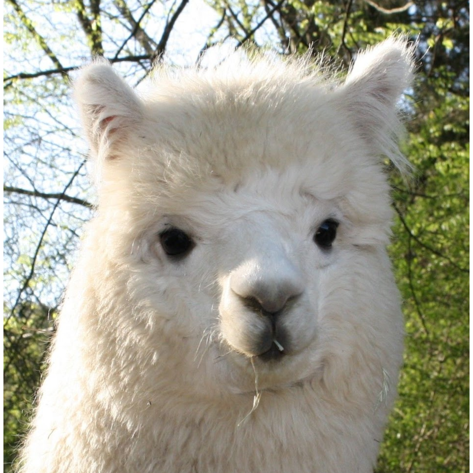

# Pogodynka AI

Desktopowa aplikacja w C++/Qt6 do pobierania prognozy pogody i generowania wykresu temperatury przy pomocy lokalnego modelu językowego (Ollama) oraz Pythona (matplotlib).

## Co robi aplikacja

1. Pobiera dane pogodowe z Open-Meteo dla wybranego miasta i zapisuje informacje w pliku `weather_data.csv` .
2. Wysyła prompt do lokalnego modelu (Ollama), aby wygenerować skrypt Python z wykresem.
3. Uruchamia skrypt i wyświetla gotowy wykres temperatury.
4. Odpowiada na pytania.

Operacje sieciowe i komunikacja z modelem działają w osobnych wątkach, więc GUI pozostaje responsywne.

## Wymagania

- Qt 6.x (Widgets, Network)
- CMake >= 3.16
- Kompilator C++17 (MinGW/MSVC/GCC)
- Python 3.x
- Ollama z pobranym modelem (np. `gemma4:e4b`) -> ten model jest używany
- doxygen

## Instalacja zależności

### 1) Python

```bash
pip install -r requirements.txt
```

### 2) Ollama

```bash
ollama pull gemma4:e4b
ollama serve
```

## Budowanie

```bash
mkdir build
cd build
cmake .. -DCMAKE_PREFIX_PATH=<sciezka_do_Qt6>
cmake --build .
```

### Budowanie z testami

```bash
cmake .. -DBUILD_TESTS=ON
cmake --build .
ctest
```

## Uruchomienie

1. Upewnij się, że działa Ollama (`ollama serve`).
2. Uruchom aplikację (`./jpo-pogodynka`).
3. Wpisz nazwę miasta i zakres prognozy.
4. Kliknij przycisk generowania wykresu.

## Tryb offline

Przy braku internetu aplikacja próbuje użyć ostatnio zapisanych danych (`weather_data.csv`).
Jeśli Ollama nie jest dostępna, aplikacja pokazuje komunikat o błędzie.

## Testy

Projekt zawiera testy jednostkowe w katalogu `tests/`:

- `test_weatherparser.cpp`
- `test_ollamaclient.cpp`
- `test_scriptrunner.cpp`
- runner: `test_main.cpp`

Uruchamianie:

```bash
cmake -S . -B build -DBUILD_TESTS=ON
cmake --build build --target jpo-pogodynka-test
ctest --test-dir build --output-on-failure
```
## Sprawdzaj pogodę !



## Zadawaj pytania !


## Struktura projektu

```text
jpo-pogodynka/
|- assets/
|  |- Doxyfile
|  |- README.md
|  |- README.txt
|  |- requirements.txt
|  |- maindev.png
|  |- seccdev.png
|  |- thirdev.png     
|  |- photoreadme.png
|  `- photoreadme2.png
|- CMakeLists.txt
|- main.cpp
|- mainwindow.cpp
|- mainwindow.h
|- mainwindow.ui
|- weatherapiclient.cpp
|- weatherapiclient.h
|- ollamaclient.cpp
|- ollamaclient.h
|- scriptrunner.cpp
|- scriptrunner.h
|- tests/
|  |- test_weatherparser.cpp
|  |- test_ollamaclient.cpp
|  |- test_scriptrunner.cpp
`- 
```

## Autorzy

D. D. </br>

J. B. </br>

M. C. </br>


Projekt edukacyjny (JPO — Jezyki i Programowanie Obiektowe).
