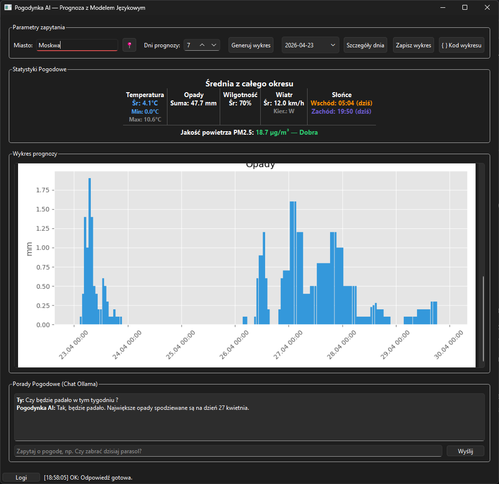

# Pogodynka AI

Desktopowa aplikacja w C++/Qt6 do pobierania prognozy pogody i generowania wykresów przy pomocy lokalnego modelu językowego (Ollama) oraz Pythona (matplotlib).

## Co robi aplikacja

1. **Automatyczna lokalizacja i podpowiedzi:** Przy uruchomieniu aplikacja korzysta z API (`ip-api.com`), aby na podstawie adresu IP automatycznie wykryć miasto użytkownika. Dodatkowo pole wyszukiwania posiada funkcję autouzupełniania z wbudowanej bazy popularnych miast.
2. **Pobieranie szczegółowych statystyk:** Pobiera dane meteorologiczne z Open-Meteo (temperatura, opady, wilgotność, siła wiatru, jakość powietrza PM2.5, wschód/zachód słońca) dla wybranej lokalizacji i zapisuje je w pliku `weather_data.csv`.
3. **Generowanie wykresów przez AI:** Wysyła prompt do lokalnego modelu (Ollama), aby wygenerować skrypt w języku Python (wykorzystujący bibliotekę matplotlib, pandas). Aplikacja sama uruchamia ten skrypt i natychmiast wyświetla w oknie gotowy wykres (liniowy temperatury i słupkowy opadów).
4. **Inteligentny asystent (Czat):** Zintegrowany czat pozwala na zadawanie naturalnych pytań o prognozę (np. "Kiedy będzie padać w tym tygodniu?", "Czy zabrać dzisiaj parasol?"). Model odpowiada precyzyjnie na podstawie pobranych statystyk i pliku CSV.

Operacje sieciowe i komunikacja z modelem językowym działają w osobnych wątkach, dzięki czemu interfejs graficzny (GUI) pozostaje zawsze płynny i responsywny.

## Wymagania

- Qt 6.x (Widgets, Network)
- CMake >= 3.16
- Kompilator C++17 (MinGW/MSVC/GCC)
- Python 3.x
- Ollama z pobranym modelem (np. `gemma4:e4b`) -> ten model jest używany
- doxygen
## Instalacja zależności

### 1) Python

```bash
pip install -r requirements.txt
```

### 2) Ollama

```bash
ollama pull gemma4:e4b # lub ollama run gemma4:e4b
ollama serve
```

## Uruchomienie w środowisku Qt Creator (Zalecane)

1. Upewnij się, że działa Ollama (`ollama serve`).
2. Uruchom aplikacje Qt Creator.
3. Z górnego menu wybierz File -> Open File or Project... i wskaż plik `CMakeLists.txt` z głównego folderu projektu.
4. W oknie konfiguracji projektu (Configure Project) zaznacz swój zestaw narzędzi (Kit, np. Desktop Qt 6.x.x MinGW 64-bit) i kliknij Configure.
5. Kliknij zielony trójkąt Run w lewym dolnym rogu ekranu (lub wciśnij skrót `Ctrl+R`), aby skompilować i uruchomić program.
6. Wpisz nazwę miasta i zakres prognozy.
7. Kliknij przycisk generowania wykresu i ciesz się pogodą!.

## Tryb offline

Przy braku internetu aplikacja próbuje użyć ostatnio zapisanych danych (`weather_data.csv`).
Jeśli Ollama nie jest dostępna, aplikacja pokazuje komunikat o błędzie.

## Testy

Projekt zawiera testy jednostkowe w katalogu `tests/`:

- `test_weatherparser.cpp`
- `test_ollamaclient.cpp`
- `test_scriptrunner.cpp`
- runner: `test_main.cpp`

### Uruchamianie testów w Qt Creator:
1. Po otwarciu projektu przejdź do zakładki Projects (ikona klucza płaskiego po lewej stronie).
2. W sekcji Build Settings -> CMake znajdź pole Initial CMake parameters (lub listę zmiennych) i upewnij się, że znajduje się tam wpis `-DBUILD_TESTS=ON` (aby CMake uwzględnił testy). Jeśli go dodałeś, kliknij Apply Configuration Changes.
3. W lewym dolnym rogu (nad zielonym przyciskiem Run) kliknij ikonę monitora/komputera.
4. W sekcji Run zmień cel (Run configuration) z głównej aplikacji (np. `jpo-pogodynka`) na cel testowy: `jpo-pogodynka-test`.
5. Kliknij zielony trójkąt Run (`Ctrl+R`). Testy wykonają się automatycznie, a ich wynik zobaczysz na dole w okienku Application Output.

## Uruchomienie z poziomu konsoli (Opcjonalnie)

```bash
mkdir build
cd build
cmake .. -DCMAKE_PREFIX_PATH=<sciezka_do_Qt6>
cmake --build .
```

```bash
cmake -S . -B build -DBUILD_TESTS=ON
cmake --build build --target jpo-pogodynka-test
ctest --test-dir build --output-on-failure
```

## Sprawdzaj pogodę !


## Zadawaj pytania !



## Struktura projektu

```text
jpo-pogodynka/
|- assets/  
|  |- photoreadme.png
|  |- photoreadme2.png
|  |- mel.png
|  |- bronek.png
|  `- rak.png
|- CMakeLists.txt
|- Doxyfile
|- README.md
|- README.txt
|- requirements.txt
|- main.cpp
|- mainwindow.cpp
|- mainwindow.h
|- mainwindow.ui
|- weatherapiclient.cpp
|- weatherapiclient.h
|- ollamaclient.cpp
|- ollamaclient.h
|- scriptrunner.cpp
|- scriptrunner.h
`- tests/
   |- test_weatherparser.cpp
   |- test_ollamaclient.cpp
   |- test_scriptrunner.cpp
```

## Autorzy

|  |  |  |
| :---: | :---: | :---: |
| **D. D.** | **J. B.** | **M. C.** |

<br>
Projekt edukacyjny (JPO — Jezyki i Programowanie Obiektowe).
